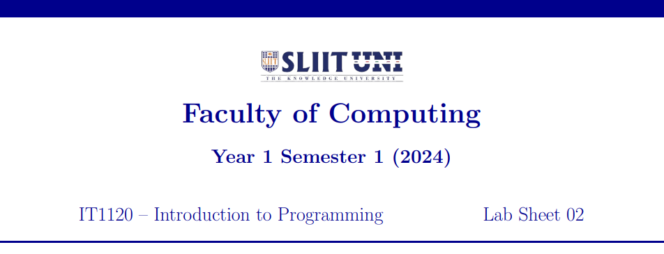
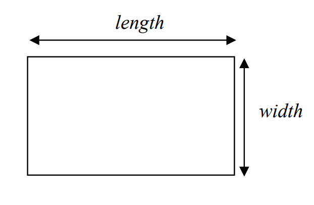
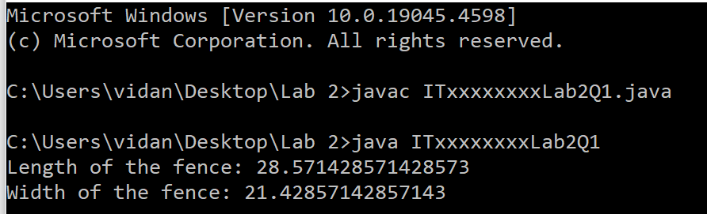
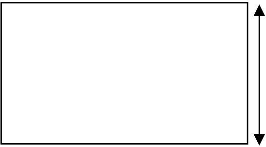
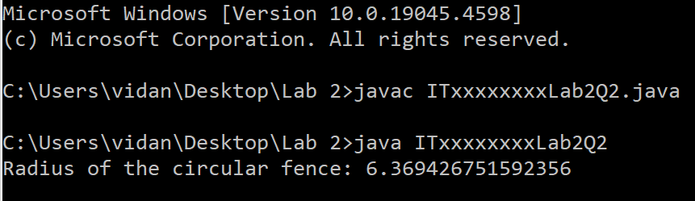
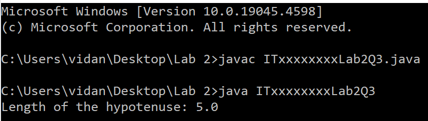

  

    
  

### Question 1 (Tutorial 1 -- Q3)

The perimeter of a rectangular fence is known. If the width of the fence
is ¾ the size of the length of the fence.

Write a Java program to determine the width and length of the fence.

*\*Hint: Perimeter of a Rectangle = 2 \* (length + width)*

  

    
  

Save the file inside '**Lab 2**' folder as: **ITxxxxxxxxLab2Q1.java**

Replace 'ITxx xxx xxx' of the filename, with your own Student ID.

Expected Output:

  

    
  

### Question 2 (Tutorial 1 -- Q4)

A rope is used to create a square fence. The length of a side of the
square is known (assume it is 10). Later this same rope is used to create a circular
fence.

Write a Java program to find the radius of the circular fence.

  

    
  

*\*Hint: Perimeter of a Square = 4 \* length*

*Circumference of Circle = 2 \* PI \* Radius*

*PI = 22/7 = 3.14*

Save the file inside '**Lab 2**' folder as: **ITxxxxxxxxLab2Q2.java**

Replace 'ITxx xxx xxx' of the filename, with your own Student ID.

Expected Output:

  

    
  

###  Question 3

Write a Java program that calculates the length of the hypotenuse of a
right triangle when two other sides are known (assume Side A = 3 and Side B = 4).

*\*Hint: Hypotenuse = square root (SideA^2 + SideB^2)*

Save the file inside '**Lab 2**' folder as: **ITxxxxxxxxLab2Q3.java**

Replace 'ITxx xxx xxx' of the filename, with your own Student ID.

Expected Output:

  

    
  

