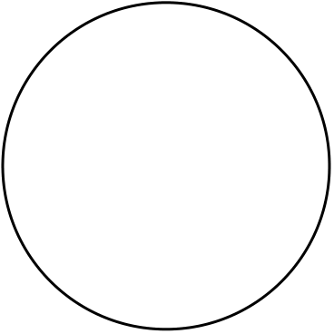

{width="0.625in"
height="0.275in"}{width="0.625in"
height="0.275in"}{width="0.625in"
height="0.275in"}

> **IT1120 -- Introduction to Programming** **Lab 2**\
> Question 1 (Tutorial 1 -- Q3)\
> The perimeter of a rectangular fence is known. If the width of the
> fence is ¾ the size of the length of the fence.
>
> Write a Java program to determine the width and length of the fence.
>
> *\*Hint: Perimeter of a Rectangle = 2 \* (length + width)*

*length*

{width="1.7638888888888888in"
height="9.722222222222222e-2in"}

> {width="1.8888888888888888in"
> height="1.0416666666666667in"} *width*
>
> Question 2 (Tutorial 1 -- Q4)\
> A rope is used to create a square fence. The length of a side of the
> square is known. Later this same rope is used to create a circular
> fence.
>
> Write a Java program to find the radius of the circular fence.

*length*

> {width="1.25in"
> height="9.722222222222222e-2in"}
>
> {width="1.2777777777777777in"
> height="1.2777777777777777in"}
>
> *\*Hint: Perimeter of a Square = 4 \* length*\
> *Circumference of Circle = 2 \* PI \* Radius PI = 22/7*
>
> Question 3\
> Write a Java program that calculates the length of the hypotenuse of a
> right triangle when two other sides are known.
>
> *\*Hint: Hypotenuse = square root (SideA2 + SideB2)*
